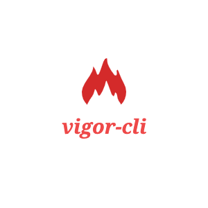

<div align="center"></div>

# vigor-cli

一款基于模版仓库快速创建应用的脚手架,当前支持的模版仓库有：

- [fe-standard-config-seed](https://github.com/fengyinchao/fe-standard-config-seed)

一个包含代码 format、lint、typescript、commitlint、changelog 等常用配置的种子模版

- [angular8-pc-manager](https://github.com/VigorDP/Angular-Manager-System)

基于 Ng-Alain 和 Ng-Zorro-Antd 构建的 Angular 管理后台项目模板

- [vue2-pc](https://github.com/VigorDP/vue2-pc)

基于 Vue 三件套的 PC 端项目模板

- [vue2-pc-manager](https://github.com/VigorDP/vue2-pc-manager)

基于 Vue 的管理后台项目

- [vue-threejs](https://github.com/VigorDP/vue-threejs)

基于 Vue 和 Three.js 的 3d 项目模板

## 使用流程

```
npm i vigor-cli -g

vigor create
```

## 维护须知

- 模版仓库配置文件位于 ./template-repo.json，可以提 PR 来加入更多模版
